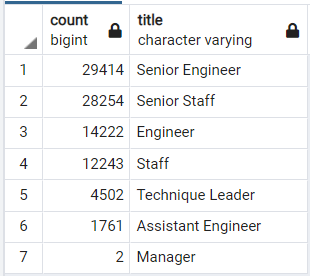
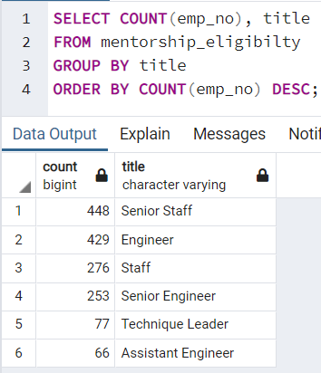

# Pewlett-Hackard-Analysis

## Overview
### Purpose
This is an analysis of the fictional Pewlett Hackard company.  This company is expecting a large amount of senior employees to be retiring soon and is looking to prepare to handle this eventuality.

## Results
- The positions most effected by upcoming retirements will be Senior Engineers and Senior Staff
- The least effected positons will be Managers and Assistant Engineers

- There are 1,549 employees that are eligible to be mentors
- There are 448 Senior Staff who could be mentors but only 253 Senior Engineers who could be mentors

## Summary
### How many roles will need to be filled due to retiring employees?  
There are 90,398 employees with birthdays between 1952-1955.

### Are there enough qualified retiremnt age employees to mentor the next generation?

